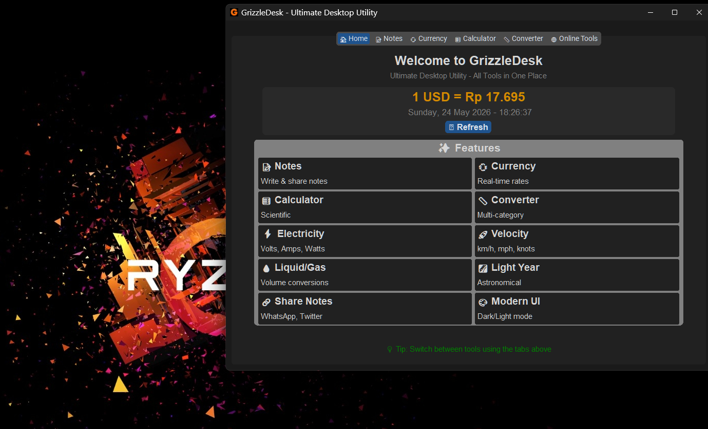
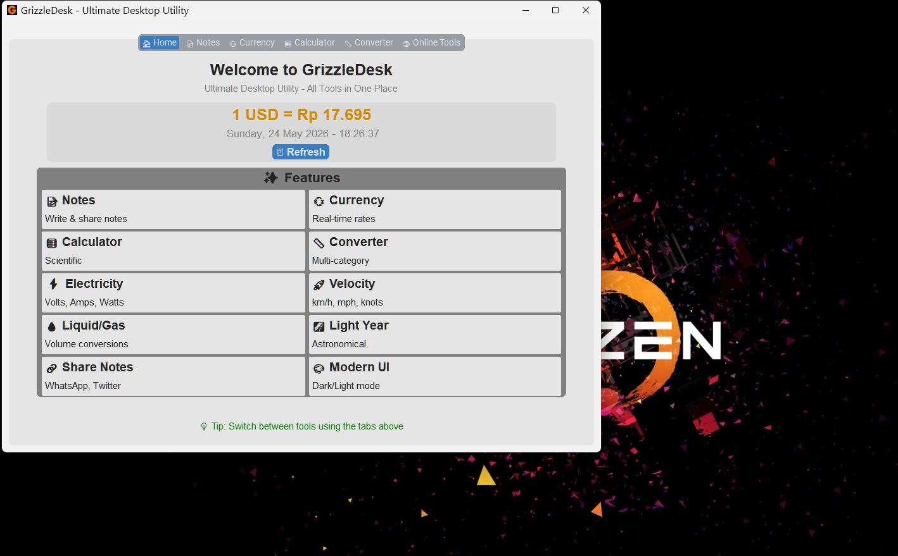

<div align="center">
  
  <h1>🛠️ GrizzleDesk</h1>
  <p><strong>Ultimate Desktop Utility – All Tools in One Place</strong></p>
  
  <p>
    
    
    
    
  </p>
  
  <p>
    
    
    
  </p>
</div>

---

## ✨ Features

| Feature | Description |
|---------|-------------|
| 📝 **Notes** | Write, save, and share notes with font options |
| 💱 **Currency** | Real-time exchange rates (Frankfurter API) |
| 🧮 **Calculator** | Scientific calculator with advanced functions |
| 📏 **Converter** | 7 categories: Length, Mass, Volume, Temperature, Electricity, Velocity, Liquid/Gas |
| 🌐 **Online Tools** | 10 website shortcuts with official favicons |
| 🎨 **Modern UI** | Dark/Light mode, smooth interface |
| ⚙️ **Portable EXE** | Run without Python installation |

---

## 🖼️ Screenshots

<div align="center">
  
  
  <br />
  <em>Home Page & Tools Overview</em>
</div>

---

## 🚀 Quick Start

### Download

Download the latest `GrizzleDesk.exe` from [Releases](https://github.com/b70386/grizzledesk/releases)

### Run

Double-click `GrizzleDesk.exe` – no installation required!

### Build from Source

```bash
git clone https://github.com/b70386/grizzledesk.git
cd grizzledesk
pip install -r requirements.txt
python main_obf.py
```

## 📁 Project Structure
```
grizzledesk/
├── main_obf.py           # Entry point (obfuscated)
├── requirements.txt      # Python dependencies
├── assets/               # Icons and images
├── tabs_obf/             # Obfuscated tab modules
├── utils_obf/            # Obfuscated utils modules
├── LICENSE               # MIT License + Trademarks
└── README.md             # This file
```

## 🛠️ Tech Stack

```
GUI Framework: CustomTkinter 5.2.2
Image Processing: Pillow 12.2.0
HTTP Requests: Requests 2.32.3
Markdown: markdown 3.7
Packaging: PyInstaller 6.20.0
```

## 🎯 Roadmap

```
Notes with font options & share
Currency converter (real-time)
Scientific calculator
Unit converter (7 categories)
Online tools shortcuts
Dark/Light mode
System tray support
Custom themes
Export notes to PDF
More currency pairs
```

## 🤝 Contributing

```
Contributions are welcome! Feel free to:
Fork the repository
Create a feature branch
Commit your changes
Push to the branch
Open a Pull Request
```

## ⚠️ Disclaimer

```
For Personal Use Only
GrizzleDesk is designed for personal productivity.
Users are responsible for complying with applicable laws and regulations.
```

## 🙏 Acknowledgments

```
### Libraries & Frameworks
- [CustomTkinter](https://github.com/TomSchimansky/CustomTkinter) – Modern GUI framework
- [Frankfurter API](https://www.frankfurter.app/) – Exchange rates
- [PyInstaller](https://pyinstaller.org) – Packaging Python apps

### Online Tools (Icons & References)
Thanks to the respective owners of:

- [GitHub](https://github.com/)
- [Python.org](https://www.python.org/)
- [Cobalt Tools](https://cobalt.tools/)
- [Hybrid Analysis](https://hybrid-analysis.com/)
- [VirusTotal](https://www.virustotal.com/)
- [iLovePDF](https://www.ilovepdf.com/)
- [iLoveIMG](https://www.iloveimg.com/)
- [BrowserLeaks](https://browserleaks.com/)
- [Fast.com](https://fast.com/)
- [ScamAdviser](https://www.scamadviser.com/)

All trademarks are property of their respective owners.

```

<div align="center"> <p>Made with 🛠️ for productivity</p> <p> <a href="https://github.com/b70386/grizzledesk/issues">Report Bug</a> • <a href="https://github.com/b70386/grizzledesk/issues">Request Feature</a> </p> </div> ```
```

